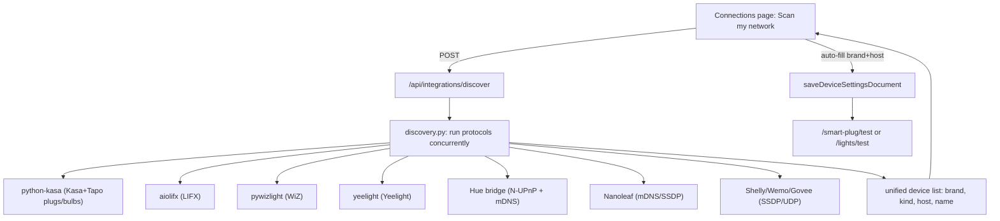

# Connect everything, the Home Assistant way: network discovery + local drivers  
rememeber it shouold connect to most things, especially the most common ones. its file if its not 1000, but i say atleast 10 different brands of smart plugs, lights, thermostats, etc 

## Goal

A "Scan my network" button finds devices automatically (no hand-typed IPs), and each common plug/light brand has a local-first driver. Cloud-only brands degrade gracefully with clear guidance.

## Current state (verified)

- Plugs: Tapo (hardened, persistent connection), Kasa, Shelly, Tuya, Wemo, Meross in [backend/roomos/devices/smart_plug.py](backend/roomos/devices/smart_plug.py).
- Lights: only Tuya works; everything else is a no-op `lights_brand_pending` in [backend/roomos/devices/lights_control.py](backend/roomos/devices/lights_control.py).
- Thermostat: Nest/Ecobee/Honeywell work in [backend/roomos/devices/thermostat.py](backend/roomos/devices/thermostat.py).
- The reusable connection manager already exists: [backend/roomos/actions/tapo_manager.py](backend/roomos/actions/tapo_manager.py).

## Architecture

## Backend changes

### 1. Discovery service - new `backend/roomos/devices/discovery.py`

- `async def discover_all(timeout=8.0) -> list[dict]` runs each protocol concurrently via `asyncio.gather(..., return_exceptions=True)`; one failing protocol never breaks the scan.
- Each protocol is lazy-imported and skipped if its lib is missing.
- Protocols: python-kasa `Discover.discover()` (split into plug vs light by `device_type`), LIFX (`aiolifx`), WiZ (`pywizlight`), Yeelight (`yeelight.discover_bulbs`), Hue bridge (`https://discovery.meethue.com` + mDNS via `zeroconf`), Nanoleaf (mDNS `_nanoleafapi._tcp`), Shelly (mDNS `_shelly._tcp`/HTTP probe), Wemo (SSDP), Govee LAN (UDP multicast `239.255.255.250:4001`).
- Use the directed `/24` broadcast trick from `tapo_manager._broadcast_for` for multi-NIC Windows.
- Returns deduped entries `{category: "smart_plug"|"lights", brand, host, model, name, fields:{...}}`.

### 2. Discovery endpoint - [backend/app/api/integrations.py](backend/app/api/integrations.py)

- `POST /api/integrations/discover` -> `{ ok, devices: [...] }`, optionally seeded with saved Tapo/Kasa creds so credentialed devices return richer info.

### 3. Light drivers - extend [backend/roomos/devices/lights_control.py](backend/roomos/devices/lights_control.py) (+ small submodules)

- Make `apply_lights_scene` route by brand with an async core and a sync shim (the endpoint calls it synchronously today).
- Drivers (each maps scene -> power/brightness/color, lazy imports, clear errors):
  - Kasa bulbs/strips via python-kasa (reuse the shared manager).
  - LIFX (`aiolifx`/`lifxlan`), WiZ (`pywizlight`), Yeelight (`yeelight`).
  - Philips Hue: local bridge REST; flow = discover bridge IP, user presses link button, POST to mint an application key (store it), then control lights/groups.
  - Nanoleaf (`nanoleafapi`): hold power button to mint token, then control.
  - Govee LAN (UDP) for supported models; fall back to a clear "enable LAN control / use API key" message.

### 4. Generalize the persistent manager - [backend/roomos/actions/tapo_manager.py](backend/roomos/actions/tapo_manager.py)

- Reuse it for all python-kasa devices (Kasa plugs + bulbs), so they get the same reuse/serialize/no-storm behavior. Tapo keeps working unchanged.

### 5. Dependencies - [backend/requirements.txt](backend/requirements.txt)

- Add (loosely pinned, optional at runtime): `aiolifx`, `pywizlight`, `yeelight`, `nanoleafapi`, `zeroconf`. All drivers and discovery import lazily so a missing wheel degrades to a clear message, never a crash.

## Frontend changes

### 6. UI: "Scan my network" + per-brand light fields

- [web/src/lib/roomos/api-client.ts](web/src/lib/roomos/api-client.ts): add `discoverDevices()`.
- [web/src/components/roomos/connections-page-client.tsx](web/src/components/roomos/connections-page-client.tsx): add a "Scan my network" button that lists found devices; picking one auto-fills brand + host (+ label) into the right category, then the existing Connect/test flow runs.
- [web/src/lib/roomos/device-connection-fields.ts](web/src/lib/roomos/device-connection-fields.ts): add fields for each light brand (Hue: bridge IP + auto app key; LIFX/WiZ/Yeelight/Kasa bulb: optional host (discovery fills); Nanoleaf: host + auto token; Govee: API key or host). Update `lightsFields`, `validateLightsConnect`, and `canConnectCategory` to allow the new brands.

## Verification

- Regression: Tapo plug on/off still fast (reused connection) via `scripts/tapo_speedtest.py`.
- Discovery: `discover_all` finds the P110M and lists it as a plug with the right host; confirm the scan runs to completion with the other protocols absent/failing gracefully.
- Unit tests: light brand routing + graceful "not installed"/"enable LAN" errors; discovery mer/dedup logic.
- `pytest tests/ -q` and frontend `npm run lint`.

## Honest scope note

- You only have the Tapo plug to test, so LIFX/WiZ/Yeelight/Hue/Nanoleaf/Govee/Kasa-bulb drivers are implemented to spec but verified only by routing/units, not real hardware. They are structured to fail with a clear message rather than hang or crash, and discovery will still surface them for when you add hardware.

