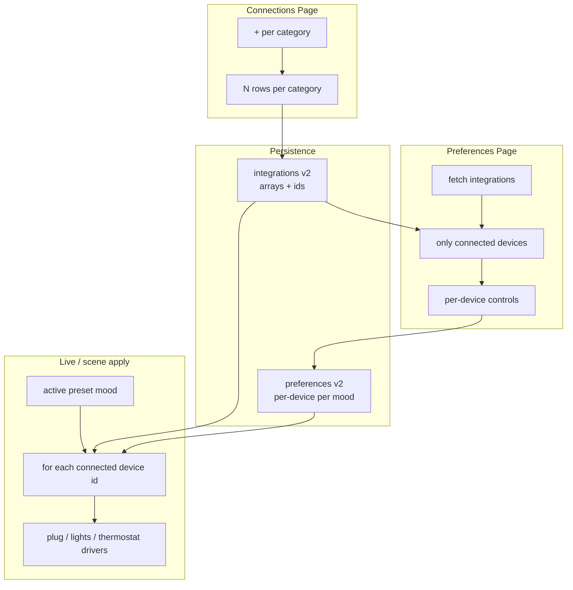

# Multi-device connections and connection-aware preferences  
MY own words: research which smart plug can do what. SO for example if its a lamp light, most smart plugs wouldn't be able to change the percent brightness or whatever, so in preferances and connections it can only be on and off. maybe some smart plugs are able to do this, so research which plugs can do this, and what cant, and change everything based on that. same with the wifi lights, if the wifi lights can't turn brightneses, then there shouoldn't be that option

## What you asked for

- **Connections**: A `+` button on each category (Smart plug, Lights, Thermostat) so users can add and manage multiple devices (e.g. two plugs, both usable).
- **Preferences**: Only show controls for devices that are actually connected — per device, labeled by name from Connections (not one generic Fan/Lights/Temperature block when nothing is connected).

Today the app is **one slot per category** end-to-end (`[device-settings.ts](web/src/types/device-settings.ts)`, `[integrations_service.py](backend/app/integrations_service.py)`, `[connections-page-client.tsx](web/src/components/roomos/connections-page-client.tsx)`). Preferences always show all four controls regardless of connections (`[state-preference-card.tsx](web/src/components/roomos/preferences/state-preference-card.tsx)`).

---

## Target data model (schema v2)

### Integrations document

Bump `schemaVersion` to `2`. Replace fixed keys with arrays; each instance gets a stable `id` (UUID).

```ts
// web/src/types/device-settings.ts
devices: {
  smartPlugs: Array<SmartPlugSettings & { id: string }>
  lights: Array<LightsSettings & { id: string }>
  thermostats: Array<ThermostatSettings & { id: string }>
}
```

**v1 → v2 migration** (in `[normalize_integrations_document](backend/app/integrations_service.py)` + frontend `[parseDeviceSettingsDocument](web/src/lib/roomos/device-settings-schema.ts)`):

- If `devices.smartPlug` is an object → `smartPlugs: [{ id: newUuid(), ...obj }]`
- Same for `lights` / `thermostat` → `lights[]` / `thermostats[]`
- Empty arrays allowed (category hidden in Preferences until first device added)

### Preferences document

Bump `schemaVersion` to `2`. Each mood stores **per-device** targets keyed by integration `id`:

```ts
// Per mood (sleep, gaming, …)
interface StateEnvironmentPreference {
  devices: Record<string, DevicePreferenceTarget>
}

interface DevicePreferenceTarget {
  fanOn?: boolean           // smart plugs
  brightness?: number       // lights
  lightColorHex?: string    // lights
  temperatureF?: number       // thermostats
}
```

**v1 → v2 migration** (in `[document.py](backend/roomos/preferences/document.py)` + `[preferences-schema.ts](web/src/lib/roomos/preferences-schema.ts)`):

- For each mood, read legacy `fanOn` / `brightness` / `lightColorHex` / `temperatureF`
- Copy values onto every connected device id of the matching type (from integrations at save time, or best-effort during normalize using current integrations load)
- When a **new device is connected**, seed defaults for that `id` across all moods (reuse existing mood defaults from `[EMPTY_PREFERENCE_MATRIX](web/src/lib/roomos/preferences-schema.ts)`)
- When a **device is removed**, strip its keys from all mood `devices` maps

---

## Architecture flow




---

## 1. Connections UI

**Files**: `[connections-page-client.tsx](web/src/components/roomos/connections-page-client.tsx)`, `[connection-device-row.tsx](web/src/components/roomos/connections/connection-device-row.tsx)`

- Replace flat `DEVICE_META.map` with **three category sections**, each containing:
  - Category header (icon, title, `N connected`)
  - List of `ConnectionDeviceRow` for `doc.devices.smartPlugs` (etc.)
  - `**+ Add smart plug`** button (same for lights / thermostat) — appends a new default instance with `crypto.randomUUID()` and expands it for setup
- Track `expanded` by `deviceId` (not category key)
- **Remove device**: add a delete/remove action (distinct from disconnect) when more than zero devices, or always allow removing empty drafts
- **Network scan** (`[applyDiscovered](web/src/components/roomos/connections-page-client.tsx)`): append a new array entry instead of overwriting the single slot
- **Header count**: `X of Y connected` where Y = total device instances across categories
- **On/Off / test / connect / disconnect**: pass `deviceId`; patch the matching array element

Optional small UX: category section still shows when array is empty with one placeholder row + `+` (so users can add first device without confusion).

---

## 2. Preferences UI (connection-aware, per-device)

**Files**: `[preferences-page-client.tsx](web/src/components/roomos/preferences-page-client.tsx)`, `[state-preference-card.tsx](web/src/components/roomos/preferences/state-preference-card.tsx)`

- Add React Query fetch for integrations (reuse `fetchDeviceSettingsDocument`, key `["roomos", "integrations", userId]`)
- Build `connectedDevices` list:

```ts
type ConnectedDevice = {
  id: string
  category: "smart_plug" | "lights" | "thermostat"
  label: string  // plug.label || lights.label || thermostat.notes || fallback
}
```

- Filter: `connected && enabled` (same semantics as Connections badges)
- Pass `connectedDevices` into `StatePreferenceCard`
- **Render logic**:
  - Smart plug → Fan toggle labeled `"Fan — {label}"` bound to `${stateId}.devices.${id}.fanOn`
  - Lights → color + brightness labeled with device name
  - Thermostat → temperature slider labeled with device name
  - **Hide entire control group** when no devices in that category are connected
- If **no devices connected at all**, show a short empty state linking to Connections (instead of five mood cards full of nothing)
- On integrations change (device added): merge new device ids into preference form with defaults (client-side helper, then save)

Update Zod form schema in `[preferences-schema.ts](web/src/lib/roomos/preferences-schema.ts)` to validate `devices` map; keep migration path for v1 documents.

---

## 3. Backend API and runtime

### Integrations normalization and tests

**Files**: `[integrations_service.py](backend/app/integrations_service.py)`, `[integrations_settings_store.py](backend/app/integrations_settings_store.py)`, `[integrations.py](backend/app/api/integrations.py)`

- v2 normalize + v1 migration
- Test endpoints accept optional `device_id` in body; resolve config from array:

```python
# POST /api/integrations/smart-plug/test
{ "device_id": "...", "state": "on" }
```

- `_maybe_heal_plug_host` updates the matching array entry by id

### Device bridge

**File**: `[device_bridge.py](backend/roomos/integrations/device_bridge.py)`

- Export runtime integrations as **lists** (or keyed map by id), e.g. `smart_plugs: [{ id, ...cfg }]`
- Keep backward-compatible read of v1 during migration window

### Scene application

**File**: `[scene_apply.py](backend/roomos/devices/scene_apply.py)`

- Change signature to accept per-device scene map from preferences v2
- Loop each connected+enabled device in integrations; read `scene["devices"].get(device_id)`
- Apply with sensible fallbacks for missing keys (new device not yet in prefs)
- Update `[live_pipeline.py](backend/roomos/inference/live_pipeline.py)` call site to pass new shape from `[active_preset_preferences](backend/roomos/preferences/document.py)`

### Preferences document backend

**File**: `[document.py](backend/roomos/preferences/document.py)`

- `active_preset_preferences()` returns per-mood `devices` map (v2)
- v1 migration helper
- Update `[preferences/apply.py](backend/roomos/preferences/apply.py)` and Telegram NL paths if they assume flat `fanOn` fields

---

## 4. Tests


| Area                         | Files                                                                        |
| ---------------------------- | ---------------------------------------------------------------------------- |
| Integrations v1→v2 migration | new test in `backend/tests/`                                                 |
| Preferences v1→v2 migration  | `[test_preferences_document.py](backend/tests/test_preferences_document.py)` |
| Multi-plug scene apply       | `[test_scene_apply.py](backend/tests/test_scene_apply.py)`                   |
| API device_id resolution     | extend `[test_tapo_plug.py](backend/tests/test_tapo_plug.py)`                |
| Frontend schema parsing      | extend device-settings / preferences schema tests if present                 |


---

## 5. Rollout notes

- **No Supabase migration SQL** — both documents stay JSON blobs in `haven_user_data`; migration runs on read/normalize.
- **Existing users**: first load auto-migrates v1 → v2; single plug becomes `smartPlugs[0]` with same settings.
- **Telegram / NL preference edits**: update to target device id (default to first connected device of type if unspecified) to avoid breaking chat flows.

---

## Out of scope (for this pass)

- Per-category roles (e.g. “fan plug” vs “lamp plug”) — you chose per-device controls instead
- Renaming categories or cross-category device types
- Home Assistant-style arbitrary device types beyond the three existing categories

